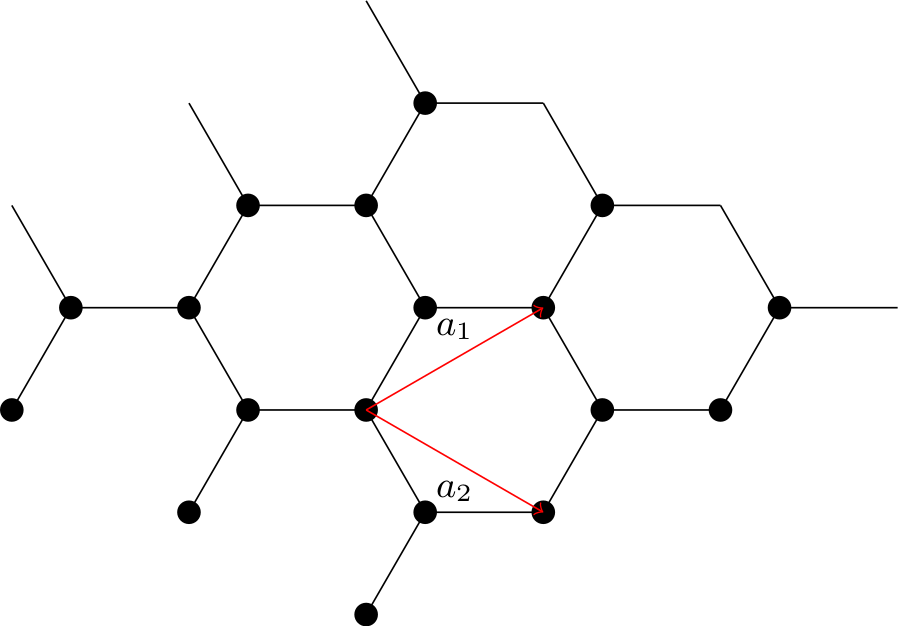

# CCTB --- A tight binding software written in C++

This is a software package for simulating tight binding models. It aims to be a simple and easy to use, making adding new models straightforward. Once you have a model, you can use it to calculate the band structure, density of states, and other properties.

## Building:

To build this project, you need to have a C++ compiler that supports C++11 and CMake. The following instructions are for Linux and macOS.

```bash
cmake -S . -B build
cmake --build build --config Release
```

The executable will be in `build/`.

## Usage:

```bash
./build/cctb --help
```

## Testing:

To run the tests, you need to run the following command:

```bash
cmake -S . -B build -DBUILD_TESTING=ON
cmake --build build --config Release --target test
```

## Examples:

Right now you can set up 1D and 2D lattices and graph their crystal structure. The following example shows how to set up a Graphene lattice and graph it.

```c++
#include "Lattice/Lattice.h"

// https://arxiv.org/abs/0709.1163
class GrapheneLattice : public TwoDimensionalLattice {
 public:
  GrapheneLattice()
      : TwoDimensionalLattice(Vector<2>(1.5, 0.5 * sqrt(3.0)), Vector<2>(1.5, -0.5 * sqrt(3.0))) {
    add_site(Point<2>{0, 0});
    add_site(Point<2>{0.5, 0.5 * sqrt(3.0)});

    // intra unit cell
    add_edge(0, 1, {0, 0}, 1.0);

    // inter unit cell
    add_edge(1, 0, {1, 0}, 1.0);
    add_edge(1, 0, {1, -1}, 1.0);
  }
};


int main(void) {
  GrapheneLattice lattice;
  std::ofstream lattice_file("lattice.tex");
  lattice.Plot(PainterBackend::kTikz, lattice_file);
  std::ofstream bz_file("brillouin_zone.tex");
  lattice.PlotBrillouinZone(PainterBackend::kTikz, bz_file);
  std::ofstream band_file("band_structure.tex");
  lattice.PlotBandStructure(band_file);
  return 0;
}
```

The Tikz backend will generate a file that can be compiled to a PDF or any other format supported by the backend using `pdflatex`. In the example above, we use the `Tikz` backend to generate a file called `lattice.tex`. We can then compile it to a PDF using `latexmk`:

```bash
latexmk -pdf lattice.tex brillouin_zone.tex band_structure.tex
```

which will generate the following images (once converted to PNG):




Additionally, we can calculate the adjacency matrix of the lattice using the `AdjMatrix` method and the Hamiltonian at a given k-point using the `HoppingMatrix` method and print them to the console.

```c++
int main(void) {
  GrapheneLattice lattice;
  std::cout << lattice.AdjMatrix() << std::endl;
  std::cout << lattice.HoppingMatrix({0.2, 0.3}) << std::endl;
  return 0;
}
```

which will print the following to the console:

```bash
$ ./build/src/cctb
[0, 1, 1, 0]
[(0,0), (2.90329,-0.00570343), (2.90329,0.00570343), (0,0)]
```

We wrap `BLAS` and `LAPACK` to calculate the eigenvalues of the Hamiltonian. We can use the `diagonalize_hermitian` method to calculate the eigenvalues and eigenvectors of the Hamiltonian at a given k-point:

```c++
#include "LinearAlgebra/LapackImpl.h"

int main(void) {
  GrapheneLattice lattice;
  Matrix<std::complex<double>> H = lattice.HoppingMatrix({0.2, 0.3});

  NumericArray<double> w(2);
  Matrix<std::complex<double>> v(2, 2);
  diagonalize_hermitian(H, w, v);

  for (int i = 0; i < w.size(); i++) {
    std::cout << w[i] << std::endl;
  }

  return 0;
}
```

which will print the following to the console:

```bash
$ ./build/src/cctb
-2.90329
2.90329
```

## License:

This project is licensed under the MIT License - see the [LICENSE](LICENSE) file for details

## Related projects:

- [pybinding](https://github.com/dean0x7d/pybinding)